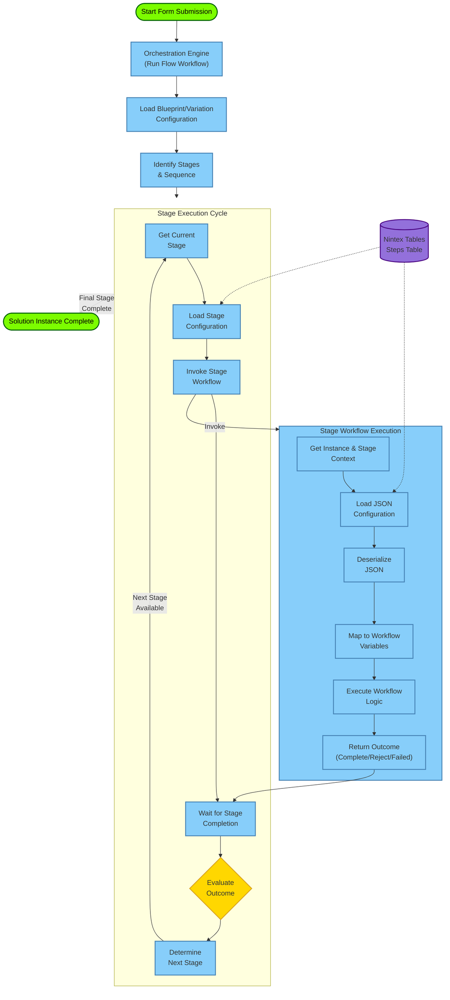
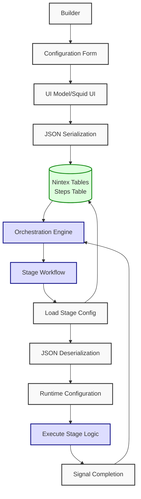

Hitchhiker's Guide to Solution Studio

# Table of Contents

-   [Solution Studio Overview](#solution-studio-overview)
    -   [Introduction](#introduction)
        -   [Purpose of Solution Studio](#purpose-of-solution-studio)
        -   [Key Capabilities](#key-capabilities)
    -   [Design Rationale](#design-rationale)
        -   [Why We Built It](#why-we-built-it)
        -   [What Does It Do](#what-does-it-do)
        -   [Challenges Addressed](#challenges-addressed)
        -   [Benefits for Customers and Partners](#benefits-for-customers-and-partners)
    -   [Platform Architecture](#platform-architecture)
        -   [Core Components: Apps, Tables, Workflows, Orchestration](#core-components-apps-tables-workflows-orchestration)
        -   [Blueprints and Variations](#blueprints-and-variations)
        -   [Deployment and Provisioning](#deployment-and-provisioning)
-   [Building Solutions in Solution Studio](#building-solutions-in-solution-studio)
    -   [Using Feature Packs](#using-feature-packs)
        -   [What Are Feature Packs](#what-are-feature-packs)
        -   [Adding and Customizing Stages](#adding-and-customizing-stages)
    -   [Form Customization](#form-customization)
        -   [Customizing the Start Form](#customizing-the-start-form)
        -   [Customizing Review and Action Task Forms](#customizing-review-and-action-task-forms)
    -   [Workflow Configuration](#workflow-configuration)
        -   [Selecting and Assigning Workflows](#selecting-and-assigning-workflows)
        -   [Modifying Workflow Logic](#modifying-workflow-logic)
-   [Technical Insights](#technical-insights)
    -   [Architecture Deep Dive](#architecture-deep-dive)
        -   [Workflow Execution Model](#workflow-execution-model)
        -   [How Workflows are Used](#how-workflows-are-used)
        -   [How the Orchestrator Binds Everything Together](#how-the-orchestrator-binds-everything-together)
        -   [Enabling Rapid Prototyping Through Reusability and Templating](#enabling-rapid-prototyping-through-reusability-and-templating)
        -   [Example Scenario: The Action Task Workflow](#example-scenario-the-action-task-workflow)
        -   [Stage Orchestration and Flow Control](#stage-orchestration-and-flow-control)
    -   [Data Handling](#data-handling)
        -   [Saving to Tables](#saving-to-tables)
        -   [JSON Serialization and Deserialization](#json-serialization-and-deserialization)
-   [Integration Framework](#integration-framework)
    -   [Integration Types](#integration-types)
        -   [Examples: Stripe, UKG](#examples-stripe-ukg)
    -   [Integration Points](#integration-points)
        -   [iPaaS Orchestration Service](#ipaas-orchestration-service)
        -   [App Pages and Workflows](#app-pages-and-workflows)
        -   [Swapping Integrations](#swapping-integrations)
-   [Advanced Customization](#advanced-customization)
    -   [Portal and App Customization](#portal-and-app-customization)
        -   [Creating a New Portal](#creating-a-new-portal)
        -   [Customizing Forms, Wizards, and Pages](#customizing-forms-wizards-and-pages)
    -   [Design System](#design-system)
        -   [Branding and Theming](#branding-and-theming)

# Solution Studio Overview

## Introduction

### Purpose of Solution Studio

### Key Capabilities

## Design Rationale

### Why We Built It

Solution Studio was developed to streamline and accelerate the process of building business solutions by unifying three core Nintex capabilities: **Apps**, **Tables**, and **Workflows**. The goal was to provide a cohesive environment where these components could be orchestrated together in a structured, repeatable, and configurable way.

The motivation behind Solution Studio stemmed from the need to:

-   **Simplify solution creation**: By offering a guided, UI-driven experience that abstracts away the complexity of wiring together forms, workflows, and data models.
-   **Enable reusability and variation**: Through the concept of **blueprints** and **feature packs**, users can define a full-featured solution once and then create tailored versions without duplicating effort.
-   **Support rapid prototyping and deployment**: Builders can define, configure, test, and publish solutions in a controlled lifecycle, enabling faster iteration and delivery.
-   **Empower both builders and end users**: Builders define the logic and structure, while end users can configure and operate within the boundaries set by the blueprint.

### What Does It Do

Solution Studio provides a structured environment for building and managing business solutions by combining Nintex Apps, Tables, and Workflows into a unified orchestration framework. It enables users to define, configure, and deploy end-to-end processes using a visual, modular approach.

At its core, Solution Studio allows users to:

-   **Create solution blueprints** that define the full functionality of a process, including forms, workflows, stages, and data models.
-   **Generate variations** of these blueprints to support different use cases or customer-specific configurations.
-   **Design and customize forms** (e.g., start forms, task forms) using Nintex Apps or Nintex Forms, depending on the desired level of control and integration.
-   **Configure workflows** to automate actions such as notifications, approvals, and task assignments.
-   **Model business processes as stages**, each representing a logical step in the lifecycle of a submission (e.g., review, action, resolution).
-   **Deploy and test solutions** in a controlled lifecycle, moving from draft to testing to published states.
-   **Package and reuse feature packs**, which are pre-configured sets of stages, forms, and workflows that accelerate solution development.

The platform also includes supporting applications such as:

-   **Admin App**: For managing configurations, reviewing submissions, and overseeing solution behavior.
-   **Portal App**: The end-user interface for submitting and interacting with solutions.

By abstracting the complexity of workflow orchestration and data handling, Solution Studio empowers both technical and semi-technical users to build robust, scalable solutions with minimal friction.

### Challenges Addressed

The development of Solution Studio was driven by several recurring challenges observed in solution delivery across different teams and customers:

#### 1\. Fragmentation of Tools and Processes

Before Solution Studio, building a complete solution required manually stitching together forms, workflows, and data models across different tools. This fragmentation led to:

-   Increased complexity in managing dependencies.
-   Higher risk of misconfiguration or inconsistency.
-   Slower development cycles due to context switching.

#### 2\. Lack of Reusability and Standardization

Teams often rebuilt similar solutions from scratch, leading to:

-   Duplication of effort.
-   Inconsistent implementation patterns.
-   Difficulty in maintaining or updating solutions at scale.

Solution Studio introduced the concept of **blueprints** and **feature packs** to address this, enabling standardized, reusable components that can be cloned and customized.

#### 3\. Limited Flexibility for End Users

Traditional workflows offered limited configurability for non-technical users. Solution Studio separates **definition** (by builders) from **configuration** (by end users), allowing:

-   Builders to define complex logic and structure.
-   End users to configure forms, stages, and workflows within safe, predefined boundaries.

#### 4\. Slow Iteration and Testing Cycles

Without a structured lifecycle, testing and deploying solutions was cumbersome. Solution Studio introduces a clear progression:

-   **Draft** → **Testing** → **Published**

This enables safe iteration, validation, and deployment of solutions.

#### 5\. Difficulty Managing Variants Across Tenants

Supporting multiple customers or departments with similar but slightly different needs was inefficient. Solution Studio’s **variation model** allows:

-   A single blueprint to serve as the master definition.
-   Variants to be created and customized without altering the core logic.

### Benefits for Customers and Partners

#### For Customers

-   **Accelerated Time-to-Value**: Customers can deploy functional solutions quickly using pre-built blueprints and feature packs, reducing the need for extensive custom development.
-   **Configurability Without Complexity**: End users can configure workflows, forms, and stages without needing to understand the underlying architecture or workflow logic.
-   **Consistency Across Solutions**: By leveraging standardized templates and reusable components, customers can ensure uniformity in how processes are implemented across departments or business units.
-   **Lifecycle Management**: The draft → testing → published lifecycle allows for safe iteration and validation before releasing changes into production environments.

#### For Partners

-   **Reusable IP**: Partners can create and package their own feature packs, workflows, and forms, which can be deployed across multiple tenants or customers.
-   **Multi-Tenant Deployment Support**: The deployment model supports tenant sets, allowing partners to manage and deploy solutions across different customer environments efficiently.
-   **Custom Branding and Extensions**: Partners can tailor the design system, portal apps, and admin dashboards to align with customer branding or specific business needs.
-   **Foundation Workflows and Feature Packs**: These accelerate delivery by providing a starting point for common tasks like reviews, approvals, and notifications, which can be extended or replaced as needed.

## Platform Architecture

### Core Components: Apps, Tables, Workflows, Orchestration

Solution Studio is built on a modular architecture that integrates four foundational components: **Nintex Apps**, **Nintex Tables**, **Nintex Workflows**, and the **Orchestration Engine**. These components are tightly coupled through a data-driven orchestration model that enables dynamic execution of business processes.

#### 🧩 Component Breakdown

##### 1\. Nintex Apps

Nintex Apps are used to build the user interface for all forms and task pages. These apps are model-driven and support:

-   **Start Forms**: Initiate a new instance of a solution (e.g., a new ticket).
-   **Task Forms**: Used in review or action stages, rendered dynamically based on configuration.
-   **UI Models**: Define the structure of data captured in forms. These models are serialized into JSON and stored in Nintex Tables.

Apps can be customized per blueprint or variation and support conditional logic, dynamic fields, and integration with external data sources.

##### 2\. Nintex Tables

Tables serve as the persistent data layer. They are used to store:

-   **Instance Data**: Each submission (e.g., a ticket) is stored in the Instances table.
-   **Flow Metadata**: The Flows table stores blueprint and variation definitions.
-   **Stage Configuration**: The Steps table contains serialized JSON configurations for each stage in a flow.

All data interactions are abstracted through the orchestration engine, which reads and writes to these tables during workflow execution.

##### 3\. Nintex Workflows

Workflows automate the logic behind each stage. They are categorized as:

-   **Stage Workflows**: Execute logic for specific stages (e.g., review, action, resolve).
-   **Notification Workflows**: Triggered on submission, completion, or rejection.
-   **Custom Workflows**: Can be created and assigned to stages or events.

Each workflow is designed to deserialize configuration data from Nintex Tables, execute logic based on that configuration, and return control to the orchestration engine.

##### 4\. Orchestration Engine

The orchestration engine is the central runtime component that coordinates the execution of a solution. It is responsible for:

-   **Loading the Blueprint**: Identifies the stages and their order.
-   **Executing the** Run Flow **Workflow**: This is the main orchestration workflow that:
    -   Retrieves the current stage.
    -   Loads the corresponding configuration from the Steps table.
    -   Invokes the appropriate stage workflow.
    -   Waits for completion and evaluates the outcome.
    -   Transitions to the next stage or completes the flow.

The orchestration engine ensures that each stage is executed in sequence and that the correct data is passed between components.

### Blueprints and Variations

Solution Studio was designed to **streamline and accelerate the process of building business solutions** by bringing together three core Nintex capabilities: **Apps**, **Tables**, and **Workflows**. The aim is to provide a **cohesive environment** for orchestrating these components in a **structured, repeatable, and configurable way**. Everything you see and build within Solution Studio is essentially an app deployed in your tenant that can be broken down, copied, and changed.

Central to this approach are the concepts of **Blueprints and Variations**.

-   The **Blueprint** serves as the **master definition** for a particular solution. It represents the **"100% of functionality"** of the solution, defining the overall structure and core components, including the data model, forms, workflows, and stages. A **default blueprint is created initially** to act as this master definition, allowing you to provide a full spectrum of the configuration, steps, and stages.
-   **Variations** are essentially **copies** of the blueprint. They are created to allow for **different configurations** of the same blueprint. This is particularly useful for supporting different use cases or customer-specific needs, providing an **efficient way to manage differences** across tenants or departments. Creating a variation is described as cloning the blueprint. For example, you can clone the default blueprint to create an "IT ticket variation" or an "HR ticket". Within a variation, you have the flexibility to make minor or major changes to how the configuration works, how the solution is executing, or which specific forms or stages are being used.

#### How Variations Enable Customization (The "How Things Work" Aspect)

Variations provide the flexibility to tailor a solution based on the standardized foundation provided by the blueprint. This customization primarily happens in key areas:

##### Forms Customization

-   You can customize the **Start Form**, which is the initial interface users interact with to submit new entries for a blueprint or variation. A default template is provided which can be cloned and customized for this purpose. Any information collected through these forms must be included as fields in the data model (specifically, the UI forms tab).
-   Solution Studio is designed to primarily use **Nintex Apps pages** (also referred to as Squid pages) for tasks, though traditional Nintex Forms can still be used.
-   **Task Forms**, used in review or action stages, can also be customized and follow the same pattern as Start Forms.
-   Each task stage typically includes both a **Configuration Form** (used by the builder to define task behavior, such as assignment or due dates) and a **Task Form** (presented to the end user completing the task). These are model-driven interfaces built with Nintex Apps.
-   If a builder wants to change the layout or logic of a task form, they can **clone the default form**, make the necessary changes, and then reassign it to the stage. This allows for safe experimentation and versioning without disrupting other solutions or variations using the original form. You can clone a form by selecting 'Save As' an existing form.

##### Data Handling with Forms

-   Configuration data entered into forms, particularly the configuration forms for tasks, is **serialized into a JSON configuration**. This data is saved in Nintex Tables.
-   Workflows then **deserialize this JSON data** to understand and execute based on the specific configuration set in the variation. This process allows the workflow to understand the model of the configuration form to run the task. You can load certain data from Nintex tables and use a custom action that will deserialize the configuration with a sample you provide. You can grab the configuration data from a form instance to get the sample JSON structure needed for deserialization in the workflow. The configuration you get will be in that format, allowing you to use it for things like setting task names, descriptions, or subject lines in emails.

##### Stages and Workflow Customization

-   You model your solution in terms of **stages**, which represent steps or gateways that the ticket or item will go through from submission to completion. Examples include submission, review, and resolution.
-   Within a variation, you can customize the stages used, including the ability to **disable or enable certain stages** through configuration to align with different variations of the process.
-   While stages often come with default workflows, you can **assign a different workflow** to a stage within a specific blueprint or variation by selecting from available workflows in the tenant.
-   To safely customize a workflow for a specific variation, a **clone-and-customize approach** is encouraged. You would clone the existing workflow (e.g., the default review task workflow), make your required changes, and then assign this new, modified version to the specific stage in your variation (e.g., the review stage in your IT ticket variation). This ensures your changes do not impact other solutions or variations using the original workflow. You can clone a workflow from the workflow list or by exporting the template and importing it with a different name. Solution Studio uses a stage workflow template to generate the workload.

#### Workflow Execution (The Orchestration)

When an instance of a solution is started by submitting a start form, a main orchestration workflow begins executing. This workflow loads the blueprint (or the specific variation), identifies the stages and their order, retrieves the corresponding configuration from tables, and invokes the appropriate workflow for each stage. It waits for the stage workflow to complete, evaluates its outcome, and then transitions to the next stage or finishes the process. This data-driven orchestration process executes the stages defined in the blueprint or variation one by one. Principal pages within Solution Studio contain necessary models (like instances, steps, and flows) that are available for building forms and workflows. These models are read-only as they are imported from the principal page, which is standard for Nintex Apps.

This separation of configuration and execution, and the ability to customize components through cloning and reassignment, is a core strength of Solution Studio. It allows builders to define flexible, reusable components while still providing end users with a tailored experience through variations. You can clone forms and workflows, assign them to stages, and use configurations saved in tables, deserialized by workflows, to drive dynamic behavior. The stages of a variation instance can be draft, testing, and published. You can deactivate and activate a published version of a variation.

## Deployment and Provisioning

Solution Studio supports a structured and repeatable deployment model that enables both internal teams and partners to provision, configure, and distribute solutions across multiple environments or tenants. This model is designed to support scalability, modularity, and governance.

### 📦 Deployment Packages

Deployment is managed through **solution packages**, which are pre-configured bundles that include:

-   **Solution Studio App**: The builder interface for defining blueprints and variations.
-   **Admin App**: Internal dashboard for managing submissions, configurations, and testing.
-   **Portal App**: The end-user interface for submitting and interacting with solutions.
-   **Foundation Workflows and Feature Packs**: Reusable components such as review tasks, action tasks, and notification workflows.

These packages are deployed into a tenant using a centralized deployment interface.

### 🧰 Provisioning Workflow

1. **Tenant Initialization**
    - A base configuration package is deployed to set up the tenant environment.
    - This includes foundational tables, default workflows, and system-level settings.
2. **Solution Studio Deployment**
    - The core Solution Studio app is installed.
    - Admin and Portal apps are deployed alongside it.
3. **Feature Pack Installation**
    - Optional feature packs (e.g., custom review tasks, document generation, e-signature stages) are deployed.
    - These are modular and can be versioned independently.
4. **Blueprint Creation**
    - A default blueprint is created to serve as the master definition.
    - Variations can be cloned from this blueprint and customized per use case.
5. **Testing and Publishing**
    - Solutions are configured and tested in the **Testing** state.
    - Once validated, they are moved to **Published**, making them available in the Portal App.

### 🌐 Multi-Tenant Support

Solution Studio supports **tenant sets**, allowing partners to manage multiple customer environments from a single interface. Key capabilities include:

-   **Cross-tenant deployment**: Packages can be deployed to any tenant in the set.
-   **Credential isolation**: Each tenant maintains its own authentication and data boundaries.
-   **Version control**: Feature packs and workflows can be updated independently per tenant.

### 🔄 Updating and Re-deploying

-   **Blueprints and Variations** can be updated without affecting the underlying orchestration engine.
-   **Workflows** can be versioned and swapped out by updating the stage configuration.
-   **Forms and UI Models** can be cloned, modified, and reassigned to stages without disrupting existing instances.

# Building Solutions in Solution Studio

## Using Feature Packs

Feature Packs are modular, reusable building blocks that encapsulate pre-configured stages, forms, and workflows. They are designed to accelerate solution development by providing ready-to-use components for common business scenarios.

### What Are Feature Packs

A Feature Pack is a bundle that typically includes:

-   One or more **stages** (e.g., Review, Action, Resolve).
-   Associated **task forms** (UI models built in Nintex Apps).
-   Pre-wired **workflows** (e.g., Foundation Review Task).
-   Configuration metadata (e.g., outcomes, assignees, email templates).

Feature Packs are deployed into the Solution Studio environment and can be selected when building or modifying a blueprint. They serve as templates that can be cloned and customized per solution.

### Adding and Customizing Stages

When building a solution:

1. **Select a Feature Pack** from the stage library.
2. The selected stage is added to the blueprint with:
    - A default title (e.g., “Review Ticket”).
    - A pre-configured workflow.
    - A configuration form for the builder.
    - A task form for the end user.
3. **Customize the Stage**:
    - Change the title and key.
    - Modify the configuration form to include additional fields (e.g., “Quote of the Day”).
    - Update the task form UI model.
    - Assign a different workflow if needed.
4. **Save and Test**:
    - The stage is now part of the blueprint.
    - It can be tested in the **Testing** lifecycle state before publishing.

Feature Packs can be versioned and extended. For example, a partner may create a custom Feature Pack (e.g., “My Review Task”) that builds on the Foundation Review Task but includes additional branding, logic, or data capture fields.

## Form Customization

In Solution Studio, forms are not static artifacts — they are dynamic, model-driven interfaces built using Nintex Apps. These forms play a central role in capturing user input, configuring task behavior, and driving workflow execution. Customization of forms happens at two key points in a solution: the **Start Form**, which initiates a process, and the **Task Forms**, which are used during intermediate stages like reviews or actions.

### Customizing the Start Form

When a builder begins defining a new solution, one of the first steps is to configure the **Start Form** — the interface through which users will submit new entries (e.g., tickets, requests, applications). Solution Studio provides a default template for this form, which can be cloned and adapted to suit the specific needs of the solution.

The customization process begins by opening the form designer. Here, the builder is presented with a UI model — a structured representation of the data fields that will be captured. These fields can be modified freely: new fields can be added, existing ones renamed or removed, and field types changed to better reflect the nature of the data (e.g., text input, dropdown, toggle, date picker).

Each field in the form is bound to a data model that is automatically serialized into JSON when the form is submitted. This JSON payload is stored in the Instances table and becomes the foundational data for the orchestration engine to act upon.

Beyond structural changes, builders can also apply business logic to the form. For example, fields can be made conditionally visible based on user input, validation rules can be enforced, and default values can be pre-populated. These behaviors are configured directly within the form designer, without requiring code.

Once the form is configured, it can be previewed and tested in the context of the solution. Importantly, the Start Form is not embedded within a workflow — it exists independently and serves as the trigger for the orchestration engine to begin executing the defined stages.

### Customizing Review and Action Task Forms

As the solution progresses through its stages, users interact with **Task Forms** — interfaces presented during steps like reviews, approvals, or actions. These forms are also built using Nintex Apps and follow a similar customization model, but with a few key differences.

Each task stage in a blueprint is associated with two forms:

1. A **Configuration Form**, used by the builder to define how the task should behave (e.g., who it should be assigned to, what outcomes are available, what notifications should be sent).
2. A **Task Form**, which is shown to the end user when the task is assigned.

When a builder adds a stage using a Feature Pack (such as the Foundation Review Task), both of these forms are included by default. However, they are fully customizable. For instance, a builder might want to add a new field to the configuration form — such as a “Quote of the Day” — that will be displayed in the task form or used in the task notification email.

To do this, the builder edits the configuration form and adds the new field. This field becomes part of the serialized JSON configuration that is stored in the Steps table. When the workflow for that stage runs, it deserializes this JSON and maps the values to workflow variables, which can then be used to control behavior — such as dynamically setting the task title, assigning users, or customizing email content.

If the builder wants to change the layout or logic of the task form itself, they can clone the default form, make the necessary changes, and reassign it to the stage. This allows for safe experimentation and versioning without disrupting other solutions that may rely on the original form.

This separation of configuration and execution — and the ability to customize both — is a core strength of Solution Studio. It allows builders to define flexible, reusable components while still giving end users a tailored experience.

## Workflow Configuration

Workflows are the automation backbone of any solution built in Solution Studio. They define what happens when a form is submitted, a task is completed, or a stage is reached. While Solution Studio provides a set of foundational workflows out of the box, builders have full control over how workflows are selected, configured, and customized for each stage of a solution.

### Selecting and Assigning Workflows

When a builder adds a stage to a blueprint — for example, a review or action task — Solution Studio automatically associates it with a default workflow. These defaults are typically part of a **Feature Pack**, such as the Foundation Review Task or Foundation Action Task. Each of these workflows is designed to handle a specific type of interaction, like assigning a task, collecting input, and routing the outcome.

However, builders are not limited to these defaults. At any point, a builder can choose to assign a different workflow to a stage. This is done through the stage configuration interface, where the builder can browse available workflows in the tenant and select the one that best fits the business logic. This flexibility allows for both reuse and specialization - a standard review workflow can be used across multiple solutions, or a custom workflow can be created for a unique process.

### Modifying Workflow Logic

Once a workflow is assigned to a stage, it can be further customized. Builders can open the workflow in the **Workflow Designer**, where they can view and modify the logic. This includes:

-   Adding or removing actions (e.g., sending emails, updating tables, calling APIs).
-   Changing the flow of execution based on conditions or outcomes.
-   Integrating with external systems or services.

For example, a builder might want to enhance a review workflow by adding a conditional branch that sends a notification to a manager if the task is rejected. Or they might want to log additional metadata to a custom table for auditing purposes.

Workflows in Solution Studio are **data-driven**. This means they rely on configuration data — typically stored as JSON — to determine how they behave. When a stage is executed, the orchestration engine loads the configuration from the Steps table, deserializes it, and passes it into the workflow as variables. This allows a single workflow to behave differently depending on how it was configured in the blueprint.

#### Dynamic Behavior Through Configuration

This configuration-driven model is what enables Solution Studio to support **variations** without duplicating workflows. For instance, two variations of a blueprint might use the same review workflow, but one assigns the task to a team lead while the other assigns it to a department head. The difference lies in the configuration, not the workflow logic.

Builders can also define **custom configuration fields** in the stage’s configuration form. These fields are serialized into the JSON payload and made available to the workflow. This allows for highly dynamic behavior — task names, email templates, escalation rules, and more can all be driven by configuration.

#### Safe Customization and Reuse

To preserve the integrity of shared workflows, Solution Studio encourages a **clone-and-customize** approach. If a builder wants to make changes to a workflow that is used in multiple solutions, they can clone it, make the necessary modifications, and assign the new version to their stage. This ensures that changes do not unintentionally affect other solutions.

This approach also supports versioning and rollback. Builders can maintain multiple versions of a workflow, test them in isolation, and promote them to production when ready.

# Technical Insights

## Architecture Deep Dive

Solution Studio operates through a sophisticated data-driven orchestration model that seamlessly integrates Nintex Apps, Tables, and Workflows. At its core is the Main Orchestration Workflow (the "run flow"), which serves as the central coordinator for solution execution—loading blueprint definitions, identifying stages, retrieving JSON configurations from Tables, and dynamically invoking stage-specific workflows. This architecture enables workflows to adapt their behavior based purely on the configuration they receive, creating a clear separation between workflow logic and configuration that supports both standardization and customization.

The system's power comes from its JSON-based configuration approach, where builder-defined settings are serialized to JSON in Tables and later deserialized by workflows at runtime. This pattern enables rapid prototyping through blueprints that serve as master templates, variations that allow customization without altering core logic, and reusable workflows that adapt to different scenarios via configuration rather than code changes. The result is a flexible, modular system where the same foundation workflows can be reused across multiple solutions with behaviors determined by their configuration, allowing builders to define complex logic while end users can configure specific behaviors within safe boundaries.

### Workflow Execution Model

The Workflow Execution Model in Solution Studio is a fundamental concept that describes how instances of a solution are run and managed. It is a **data-driven orchestration process** that coordinates the interaction between Nintex Apps, Tables, and Workflows.

Here's a detailed explanation of how it works:

When an instance of a solution is started, typically by submitting a start form. This action triggers the execution of a **main orchestration workflow**, also referred to as the "**run flow**" workflow. This is the central component responsible for overseeing the entire solution instance execution.

The process orchestrated by the main run flow workflow unfolds in stages:

-   **Loading the Blueprint or Variation**: The first step for the main orchestration workflow is to load the definition of the solution being executed, which is either the blueprint or a specific variation of it. The blueprint is the master definition, representing the full spectrum of functionality, while variations are copies with different configurations.
-   **Identifying Stages**: The orchestration workflow identifies the stages that are defined within the loaded blueprint or variation and determines the order in which they should be executed. Solutions are modeled in terms of stages.
-   **Retrieving Configuration**: For each stage, the orchestration workflow retrieves the corresponding configuration data. This crucial configuration is stored persistently in **Nintex Tables**, specifically in the Steps table. The workflow uses context, such as the instance ID (Orchestration ID) and the current stage ID, to find the relevant configuration data.
-   **Invoking Stage Workflows**: Based on the retrieved configuration, the orchestration workflow invokes the appropriate, often more specific, workflow designed for that particular stage. Solution Studio provides foundational workflows for common stage types like Review and Action tasks. Builders can select and assign these specific workflows to stages during the solution definition process.
-   **Data Passing and Deserialization**: When a stage workflow is invoked, it needs access to the configuration data for that stage. This configuration data is typically stored and passed in **JSON format**. The stage workflow retrieves the JSON configuration from the tables and performs **JSON deserialization** using dedicated "JSON Tools". To correctly deserialize the JSON, the workflow needs to understand the structure (data model) of the configuration form that was originally used to generate the JSON.
-   **Stage Workflow Execution**: The stage workflow then executes its specific logic, driven dynamically by the deserialized configuration data now available as workflow variables. For example, the "Foundation action task workflow" is a stage workflow that handles action tasks, and its behavior (like task details) is determined by the loaded JSON configuration.
-   **Evaluating Outcome and Transitioning**: Once the stage workflow completes its execution, the main orchestration workflow waits for its completion and evaluates the outcome returned by the stage workflow. Based on this outcome, the orchestration workflow determines the next stage to execute or concludes the overall solution instance. This iterative process continues until the solution instance is finished.

Essentially, the main orchestration workflow handles the "when" and "what" (which stage, which configuration), while the stage workflows handle the "how" (the specific logic for a task or process step).

### How Workflows are Used

Workflows are the automation engine within Solution Studio. They are used at multiple levels:

-   **Main Orchestrator Workflow (Run Flow)**: This is the primary workflow triggered when a solution instance starts. Its role is to orchestrate the entire process by calling the appropriate stage workflows sequentially.
-   **Stage Workflows**: These workflows execute the specific logic for individual stages within a solution, such as handling a review task, an action task, or an integration step. They are invoked by the main orchestrator and their behavior is driven by configuration data. Solution Studio provides foundational stage workflows like the Foundation Action Task and Foundation Review Task.
-   **Notification Workflows**: Workflows can also be triggered by specific events like submission, completion, or rejection.
-   **Custom Workflows**: Builders can create their own workflows and assign them to stages or events as needed.

Workflows within Solution Studio are explicitly designed to read and deserialize configuration data from tables to drive their execution logic. They are not hardcoded for a specific scenario but can adapt based on the loaded JSON configuration.

### How the Orchestrator Binds Everything Together

The orchestration engine, embodied by the main run flow workflow, acts as the central nervous system of a solution instance. It ties together the various components:

-   **Blueprints/Variations**: The orchestrator loads the defined process structure from the blueprint or variation.
-   **Tables**: It retrieves the stage-specific configuration data from Nintex Tables.
-   **Workflows**: It dynamically invokes the correct stage workflow based on the current stage and configuration.
-   **Data Flow**: It manages the flow of execution from one stage to the next based on workflow outcomes.

The orchestrator ensures that the data model defined in the blueprint/variation (stages, their order, associated configurations) is correctly interpreted and executed by the appropriate workflows using the stored configuration data.

### Enabling Rapid Prototyping Through Reusability and Templating

The Workflow Execution Model, particularly its data-driven nature and the use of blueprints and variations, significantly enables rapid prototyping and reusability.

-   **Blueprints and Variations**: A blueprint serves as a master template for a solution, defining its core structure and components. Variations are easily created by cloning the blueprint, allowing builders to quickly generate different versions of the same process for different use cases or departments (like an IT ticket versus an HR ticket).
-   **Data-Driven Workflows**: Generic, reusable stage workflows (like the Foundation Action Task) can be used across multiple stages and variations because their specific behavior is dictated by the JSON configuration loaded at runtime, not by hardcoded logic. This means builders don't have to create a new workflow for every slightly different scenario.
-   **Feature Packs**: Pre-configured bundles of stages, forms, and workflows (Feature Packs) can be deployed and reused, accelerating the initial setup of common solution types.
-   **Clone and Customize**: When customization is needed for a specific variation, builders are encouraged to clone existing workflows (or forms) rather than modifying shared ones. This allows for safe experimentation and versioning without impacting other solutions.
-   **Separation of Definition and Configuration**: Builders define the complex logic and structure in workflows and blueprints, while end users or administrators can configure aspects like task assignments or form fields within defined boundaries. This allows for flexibility without requiring deep technical expertise for every change.

This modular and configurable approach allows builders to define a comprehensive solution structure once and then rapidly create tailored instances or variations by modifying configuration data and reusing existing workflows and forms.

### Example Scenario: The Action Task Workflow

Based on the discussions, let's consider an example using the **Foundation action task workflow**.

1.  **Configuration (Builder)**: A builder defines a stage in a solution blueprint or variation that requires an action task. Using a configuration form (often built with Squid UI) for this stage, the builder specifies details like the task title, instructions, assignee, and perhaps due date. When the builder saves this configuration, the data from the form fields is **serialized into a JSON payload**. This JSON payload is then saved to the Steps table, associated with that specific stage in that solution's definition.
2.  **Execution (Orchestration Engine)**: During the execution of a solution instance, the main run flow orchestration workflow reaches the stage defined for the action task.
3.  **Loading and Invocation**: The orchestrator identifies the Foundation action task workflow assigned to this stage. It retrieves the JSON configuration for this stage from the Steps table and invokes the Foundation action task workflow, passing relevant context like the orchestration ID.
4.  **Deserialization (Stage Workflow)**: The Foundation action task workflow begins executing. Its first step is to load the received JSON configuration from the tables. Using its built-in JSON Tools, it performs **JSON deserialization**. For this to work, the workflow must be designed with the knowledge of the data model of the configuration form used to create the JSON.
5.  **Dynamic Behavior (Stage Workflow)**: Once deserialized, the configuration data (task title, instructions, assignee, etc.) becomes available as variables within the workflow. The workflow uses these variables to execute its logic dynamically. For example, it creates a task instance in the Nintex task list, assigning it to the specified user, setting the title, and including the instructions based on the deserialized data. The UI knows which form to load for the task based on this configuration.
6.  **Completion**: The Foundation action task workflow completes once the task is acted upon (e.g., approved or rejected). It signals its outcome back to the main orchestration workflow.

Crucially, the same Foundation action task workflow can be used for multiple different action task stages in the same or different solutions/variations. The only difference is the JSON configuration loaded for each specific instance and stage. The workflow itself does not need to "understand anything else" beyond the structure of the configuration JSON it receives for its specific execution. This demonstrates how a single, reusable workflow can exhibit dynamic behavior purely through data-driven configuration.

### Stage Orchestration and Flow Control

Okay, let's delve into how Stage Orchestration and Flow Control function within Solution Studio, leveraging the integrated architecture of Nintex Apps, Tables, and Workflows as described in the sources.

**Solution Studio: A Unified Platform**

Solution Studio is designed to streamline and accelerate the creation of business solutions by unifying three core Nintex capabilities: **Apps**, **Tables**, and **Workflows**. The goal is to provide a **cohesive environment** where these components can be orchestrated together in a **structured, repeatable, and configurable way**. Everything you build within Solution Studio is essentially based on an app deployed in your tenant.

**The Core Concept: Stages and Orchestration**

The fundamental idea for modeling business processes in Solution Studio is the use of **Stages**. Stages represent logical steps or gateways that an item or case, such as a ticket in a ticketing system, will go through from its submission to completion. You model your solution in terms of these stages.

At the heart of the execution is the **Orchestration Engine**, primarily implemented as the **main orchestrator workflow**, also known as the "run flow" workflow. This engine is the central runtime component responsible for coordinating the execution of a solution instance.

**Information Architecture and Blueprints/Variations**

Solution Studio organizes solutions based on a specific information architecture:

-   Every solution has **Flows**.
-   Flows are the **blueprints**.
-   Every flow has **stages**.
-   Every stage has **configuration pieces**, now called **steps**.

The **Blueprint** serves as the master definition for a solution, defining the overall structure and components like forms, workflows, stages, and data models. A default blueprint is initially created to act as this master definition. **Variations** are copies of the blueprint created to allow for different configurations of the same process, enabling support for various use cases or customer needs.

**Defining Stages and Configuration (Builder Experience)**

As a builder within Solution Studio:

-   You define a new solution and envision how it will be built.
-   You start modelling the solution in terms of stages.
-   Stages often come from **Feature Packs**, which are reusable bundles of pre-configured stages, forms, and workflows. You select a feature pack from a library to add a stage.
-   For each stage, you define its configuration. This is done using **configuration forms**. These forms are model-driven interfaces built using Nintex Apps (also referred to as Squid pages).
-   Configuration forms allow you to define parameters for how the stage will behave, such as assigning a task, setting due dates, or enabling/disabling optional steps within the stage.

**Connecting Stages (Flow Control Definition)**

The sources don't explicitly detail the visual flow control _design_ interface (like drawing lines between stages), but they emphasize a data-driven approach to _execution_. Stages are executed based on the sequence defined in the blueprint/variation. **Outcomes** from a stage workflow determine the subsequent flow. Stages give some sort of outcome, and there are certain conventions for these outcomes like Completed, Rejected, or Failed.

**The Role of Tables and JSON in Orchestration**

This is where the persistent storage in Nintex Tables and the use of JSON become critical for enabling dynamic, data-driven orchestration:

-   **Storing Configuration in Tables**: The configuration details defined by the builder in the configuration forms are not hardcoded into the workflow logic. Instead, the data entered into the form fields is **serialized into a JSON payload**. Each field in the form is bound to a data model that gets serialized. This JSON configuration is then **saved into a column within a Nintex Table**, specifically the **Steps table**. The stored JSON typically includes linkage information, such as the stage ID, allowing retrieval at runtime.
-   **Workflows are Data-Driven**: Workflows in Solution Studio rely on this configuration data, typically stored as JSON, to determine their behavior. A single workflow can behave differently based on the configuration it receives.
-   **Retrieving Configuration at Runtime**: During the execution of a solution instance, when the Orchestration Engine (the run flow workflow) reaches a specific stage and invokes the corresponding **Stage Workflow**, that workflow needs its dynamic configuration. The workflow retrieves the relevant JSON configuration from the Steps table, using context like the instance ID and stage ID.
-   **Deserializing JSON in Workflows**: The stage workflow then performs **explicit JSON deserialization**. Tools like **"JSON Tools"** are used for this purpose. To successfully deserialize the JSON, the workflow needs to understand the expected structure, derived from the UI model or data model of the configuration form. This deserialized data is then available to the workflow as variables, which drive its logic dynamically. For example, the Foundation action task workflow retrieves the step with a key equal to "action-task" to get its configuration.

**Patterns: Reusable Workflows and Configuration Flexibility**

A key pattern is the use of **reusable Foundation workflows**, such as the Foundation Action Task workflow. These workflows are designed to be generic and handle common patterns like assigning a task or seeking review. Their specific behavior is driven by the configuration JSON they receive.

While you can build a stage with a **custom workflow** for a specific need, the foundation workflows provide out-of-the-box capability. The stage workflow template is available when you create a new workflow.

This separation of configuration (via forms and JSON in tables) from the core workflow logic allows for:

-   **Limitless variations** of the same process by changing configuration via forms.
-   **Dynamic behavior** based on configuration, not static workflow design.
-   **Reusability** of workflows across different stages or variations.
-   **Safe customization** through cloning of forms and workflows.

**Flow Control Execution**

The diagram below illustrates the complete flow control execution process in Solution Studio, showing how the Orchestration Engine coordinates the execution of stages, interacts with workflows, and handles the data-driven approach through JSON configuration:

During execution, the Orchestration Engine:

1.  Loads the blueprint or variation.
2.  Identifies the stages and their order.
3.  Retrieves the configuration for the current stage from the Steps table.
4.  Invokes the appropriate stage workflow, passing the configuration data.
5.  Waits for the stage workflow to complete.
6.  **Evaluates the outcome** returned by the stage workflow (e.g., Completed, Rejected, Failed).
7.  Transitions to the next stage based on the outcome and the defined flow logic.

The orchestration is described as **data-driven**, not pre-hardcoded or designed in a static state machine. This data-driven approach for case management makes sense because it allows the ability to disable and enable stages from the front end through configuration.

**Expected Outcomes**

The expected outcomes of this system include:

-   A structured and repeatable process for building solutions.
-   Dynamic execution of processes based on configuration.
-   The ability to create and manage variations of solutions efficiently.
-   Reusable components (stages, forms, workflows) that can be cloned and customized.
-   Decoupling of workflow logic from specific configuration details via JSON.
-   Clear separation between defining complex logic (builder) and configuring behavior (end user/variation administrator).

In summary, Stage Orchestration and Flow Control in Solution Studio rely on the Orchestration Engine executing defined stages, where the behavior of each stage's workflow is dynamically driven by configuration data stored as JSON in Nintex Tables. This process involves forms for capturing configuration (serialization to JSON), tables for persistence, and workflows for executing logic (deserialization from JSON), enabling a flexible, reusable, and configurable approach to building solutions.

## Data Handling

### Saving to Tables

In Solution Studio, **Tables** are a fundamental and integrated component, working alongside Nintex Apps and Workflows to form the core architecture. They serve as the **persistent data layer** for the entire solution, storing both metadata about the solutions themselves and runtime data generated during solution execution.

Here's a breakdown of how Tables are used:

-   **Persistent Storage for Solution Data**: Tables are where information about your solutions, blueprints, variations, and instances is saved and managed. Everything defined in Solution Studio is saved in a table structure, typically involving five or six tables.

-   **Key Tables and Their Purpose**:

    -   **Instances Table**: This table stores data for **each individual submission** or instance of a solution, such as a new ticket.
    -   **Flows Table**: This table holds the definitions of solution **blueprints and variations**.
    -   **Steps Table**: This is a critical table for the execution model. It contains the **configuration details for each stage** or step within a solution blueprint or variation. These configuration details are stored as **serialized JSON**.

-   **Storing Configuration Data (JSON Serialization)**: When a builder defines or modifies a stage within a solution using a configuration form (often built with tools like Squid UI), the data entered into the form's fields is **serialized into a JSON payload**. This JSON configuration, which can include details like task assignees, due dates, or specific instructions, is then saved into the **Steps table**. Each field in the configuration form is bound to a data model that gets serialized. The stored JSON also includes linkage information, such as the stage ID, allowing the system to retrieve the correct configuration later.

-   **Driving Workflow Execution (JSON Deserialization)**: During the runtime of a solution instance, the Orchestration Engine (the main run flow workflow) uses the information stored in Tables to guide the process. When a stage workflow is invoked, it retrieves the relevant JSON configuration for that specific stage from the **Steps table**. It then performs **JSON deserialization** using dedicated "JSON Tools". For this to work, the workflow needs to understand the structure (the data model) of the configuration form that originally created the JSON. The deserialized data becomes available as workflow variables, allowing the workflow to execute its logic dynamically based on the configuration set by the builder. This ability to work concurrently with JSON and tables is described as foundational.

-   **Leveraging Strong Typing (via UI Models) and Supporting Change (via JSON)**: While Nintex Tables themselves provide structured storage with defined columns, the configuration data stored _within_ a specific column (typically holding the JSON) relies on the structure defined by the **UI Model** or data model of the configuration form. The tables provide a consistent place to store this data, but the detailed schema _of the configuration itself_ is contained within the JSON document based on the form's model. This approach provides a balance:

    -   The table structure ensures data is persistently stored and linkable (e.g., linking a configuration JSON to a specific stage and instance via IDs).
    -   Storing the flexible configuration details as JSON within the table column **supports change and variation**. Builders can add new fields to a configuration form, update the form's UI model, and the resulting JSON stored in the table will reflect these changes. Workflows designed to deserialize based on the form's model can adapt to these changes without requiring modification to the underlying table schema for every configuration tweak. This enables reusability, as a single workflow can handle different configurations stored as JSON in the table.

-   **Integration with Apps and Workflows**: Tables act as the bridge between the user interface (Apps/Forms) and the automation logic (Workflows). Apps are used to input data and configuration, which is serialized to JSON and saved in tables. Workflows read this data from tables, deserialize it, and execute actions accordingly. Principle pages in Solution Studio contain models for core entities like instances, steps, and flows, making it easier to build forms and workflows that interact with these tables.

-   **Enabling Reusability and Rapid Prototyping**: By storing configurations in tables as JSON, Solution Studio allows generic, reusable workflows (like the Foundation Action Task) to behave dynamically based on the specific JSON loaded for a given stage and instance. This separation of logic (in workflows) and configuration (in tables) significantly accelerates solution development and enables rapid prototyping and variations. Cloning solutions and variations often involves copying or configuring data stored in these tables. Feature Packs, which bundle pre-configured stages, forms, and workflows, also utilize tables to store their configuration metadata.

In summary, Tables in Solution Studio are not just simple data repositories; they are an active part of the execution model, storing the configuration data as persistent JSON documents that bridge the gap between form-based configuration and dynamic workflow execution, enabling reusability, variation, and rapid development.

### JSON Serialization and Deserialization

Within Solutions Studio, **JSON serialization and deserialization** are core technical processes that enable the platform's **data-driven orchestration** model and tightly connect its fundamental components: Apps (Forms), Tables, and Workflows. Instead of traditional static workflow state machines, Solutions Studio uses configuration data, primarily managed and transferred via JSON, to dynamically determine how solutions behave at runtime.

Here is a detailed explanation of how this process works:

-   **Configuration via Forms (Serialization)**: The lifecycle begins when a builder defines or customizes a solution's behavior through user interfaces known as **configuration forms**. These forms are often built using a framework like Squid UI and represent a specific UI model or structure. When a builder configures a stage or a specific step within a blueprint or variation and saves their changes, the structured data they entered into the form is **serialized into a JSON payload**. This transforms the structured data from the form's fields into a text-based JSON format. Each field in the form is bound to a data model that gets serialized.

-   **Persistence in Tables**: The serialized JSON configuration is then stored persistently in **Nintex Tables**. The configuration details for each stage, referred to as **steps**, are specifically saved in a table called the **Steps table**. The ability to work concurrently with JSON and tables is described as foundational to this model. The stored JSON includes linkage information, such as the stage ID and a specific configuration key (e.g., "action-task"), which allows the system to later retrieve the correct configuration during execution.

-   **Execution and Retrieval**: During the execution of a solution instance, the Orchestration Engine, which acts as the main run flow workflow, progresses through the defined stages of the blueprint or variation. When the Orchestration Engine invokes a specific **Stage Workflow** for a particular stage, that workflow needs access to the configuration data relevant to the steps within that stage. The workflow retrieves the necessary JSON configuration from the Steps table, using context like the instance ID (Orchestration ID) and the current stage ID to perform the lookup.

-   **Deserialization in Workflows**: Upon loading the JSON data, the Stage Workflow performs **explicit JSON deserialization**. This is accomplished using specific workflow actions or functions, collectively known as **"JSON Tools"**. These tools are considered critical for working with JSON across the platform. To successfully deserialize the JSON, the workflow **needs to understand the structure (or model) of the configuration form** that originally generated the JSON. Providing a sample JSON structure from the form instance can help the workflow define the variables needed for deserialization.

-   **Dynamic Execution**: Once deserialized, the configuration data becomes available within the workflow as **workflow variables**. This empowers the stage workflow to behave **dynamically**, adjusting its logic based on the specific configuration loaded for that particular instance and stage. The workflow can then use this deserialized data to carry out actions such as assigning tasks, sending emails, or performing integrations, with specifics (like task names, descriptions, or assignees) determined by the configuration. This loading and deserialization mechanism is described as "very critical to everything" done within this model.

This sequence establishes a core pattern for solution building. Builders configure functionality via forms (serializing to JSON), the configuration is stored persistently in tables, and workflows retrieve, deserialize, and execute based on that JSON data. This approach combines **structured persistence** (the form defines the JSON structure stored in tables) with a **dynamic execution mechanism** (workflows adapt based on the loaded JSON).

The use of JSON in this manner **binds the core components**:

-   **Apps/Forms** (built with frameworks like Squid UI) provide the interface for creating configuration data and serializing it into JSON.
-   **Tables** (especially the Steps table) serve as the persistent storage for the serialized JSON configuration.
-   **Workflows** retrieve the JSON from tables, deserialize it using JSON Tools, and use the resulting data to dynamically drive their execution logic.

This model fundamentally enables **reusability and variation**. Generic workflows can be utilized across numerous stages and blueprints because their specific behavior is determined by the JSON configuration loaded at runtime, rather than requiring unique, hardcoded logic for every scenario. This supports **rapid prototyping and deployment**. Builders can define a comprehensive solution in a blueprint and then quickly create tailored variations by simply modifying the configuration via forms, which updates the JSON data that the workflows read. The structured lifecycle (Draft -> Testing -> Published) further supports faster iteration.

Here is a visualization of this core information flow using Mermaid.js:

**Example Scenario: The "Action Task" Stage in a Ticketing System**

Let's illustrate this with the scenario of a ticketing system blueprint containing a stage titled **"Action Task"**. This stage represents a point in the case progression where a user needs to perform a simple action or follow instructions.

1.  When the builder designs this specific stage in the blueprint, they select a workflow to be executed, such as the reusable **"Foundation action task workflow"**.
2.  They also use a configuration form specific to this "Action Task" stage to define details like the specific instructions for the task or who the task should be assigned to.
3.  This configuration data entered by the builder is **serialized into JSON** and saved in the Steps table, linked to this particular stage, potentially using a key like "action-task".
4.  Later, when an instance of the ticket is processed by the Orchestration Engine and reaches the "Action Task" stage, the engine invokes the configured "Foundation action task workflow".
5.  The "Foundation action task workflow" is designed to be generic. To know what _specific_ action to take for _this_ instance of the stage, it retrieves context like the instance ID and the current stage ID.
6.  Using this context, it looks up and loads the relevant JSON configuration from the Steps table that was saved earlier by the builder for this specific "Action Task" stage.
7.  The workflow then performs **JSON deserialization** of this loaded data using JSON Tools.
8.  Once deserialized, the workflow has access to workflow variables derived from the JSON, containing the exact instructions or assignee defined for _this specific_ "Action Task" stage.
9.  The workflow uses this deserialized data to execute its logic, such as creating a task assigned to the specified user and displaying the deserialized instructions within that task.

Crucially, the "Foundation action task workflow will not understand anything else" about configurations from other stages. Its operation is entirely driven by the specific JSON data loaded and deserialized for the stage it is currently executing within. This highlights how JSON serialization and deserialization allow a single, generic workflow to exhibit dynamic, stage-specific behavior, enabling the reuse of workflows across different parts of a solution and across different variations. You can even have multiple distinct configurations (steps) within the same stage, each potentially using the same workflow but with different JSON configurations, and the workflow handles them based on the specific data loaded for each step.

# Integration Framework

## Integration Types

### Examples: Stripe, UKG

## Integration Points

### iPaaS Orchestration Service

### App Pages and Workflows

### Swapping Integrations

# Advanced Customization

## Portal and App Customization

### Creating a New Portal

### Customizing Forms, Wizards, and Pages

## Design System

### Branding and Theming
