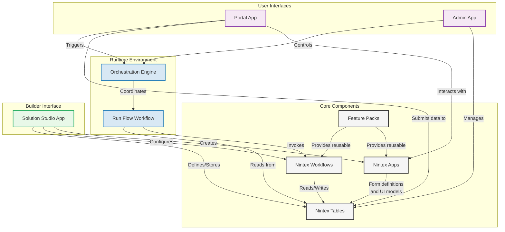
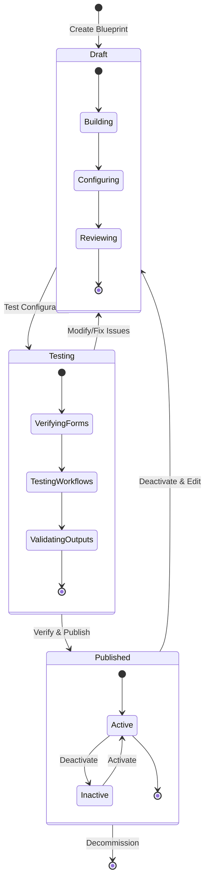
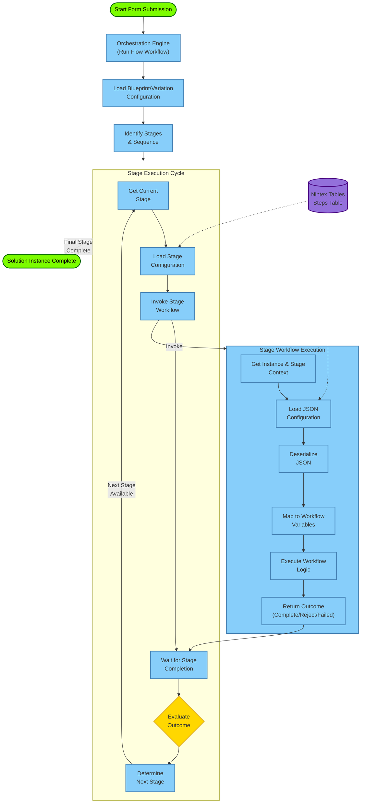
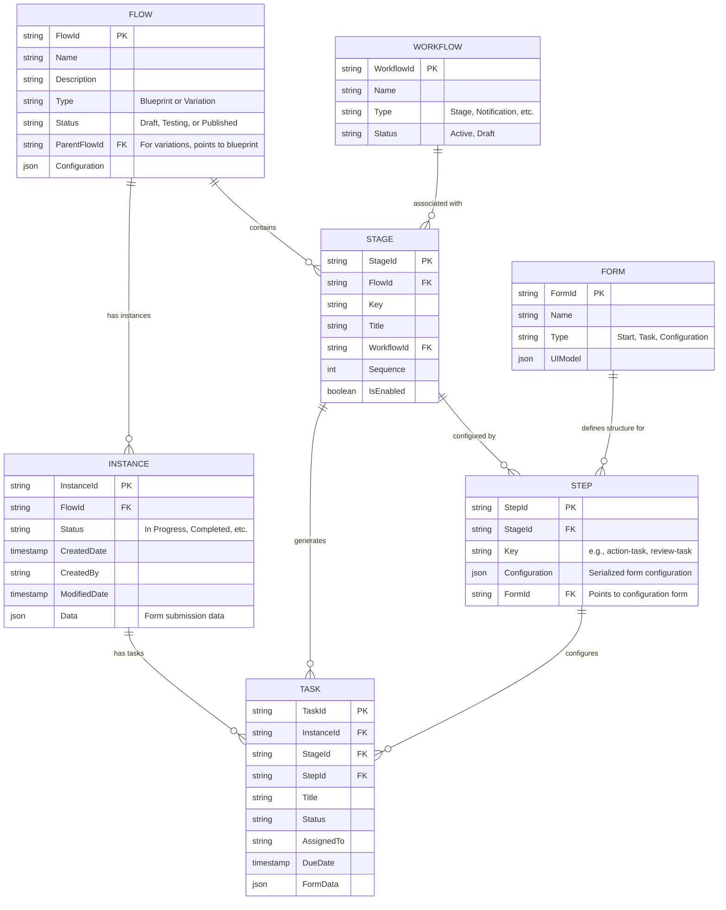
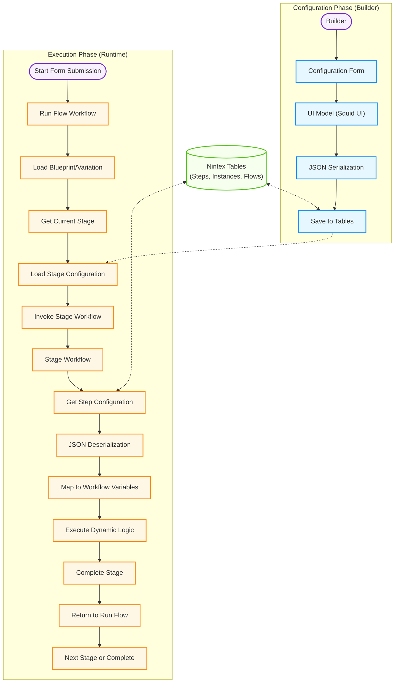
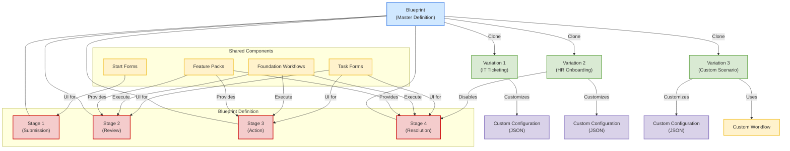

# Solution Studio Architecture Diagrams

This document provides visual representations of key Solution Studio architecture concepts using mermaid.js diagrams.

## Table of Contents
- [Core Component Architecture](#core-component-architecture)
- [Blueprint Lifecycle](#blueprint-lifecycle)
- [Solution Execution Flow](#solution-execution-flow)
- [Entity Relationship Diagram](#entity-relationship-diagram)
- [Data-Driven Orchestration Process](#data-driven-orchestration-process)
- [Blueprint and Variation Model](#blueprint-and-variation-model)

## Core Component Architecture

The following diagram illustrates the core components of Solution Studio and how they interact:

## Blueprint Lifecycle

The following diagram illustrates the lifecycle states of a blueprint or variation in Solution Studio:

## Solution Execution Flow

This diagram shows how a solution instance executes through the orchestration engine:

## Entity Relationship Diagram

This diagram shows the relationship between the key persistent entities in Solution Studio:

## Data-Driven Orchestration Process

This diagram illustrates the JSON serialization and deserialization process that drives the data-centric orchestration:

## Blueprint and Variation Model

This diagram shows the relationship between blueprints and variations, and how they utilize components:

